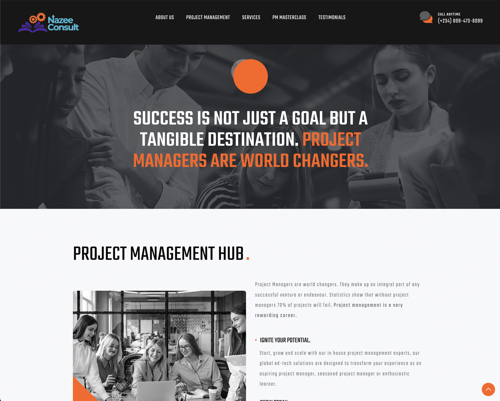
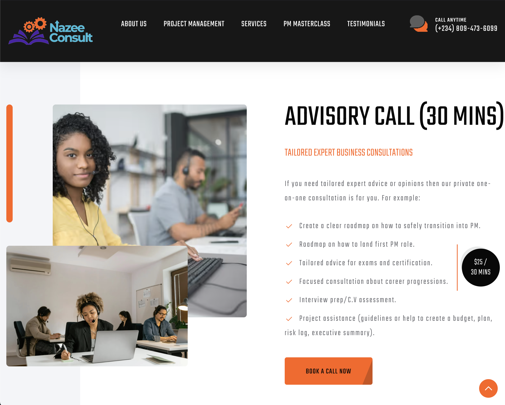
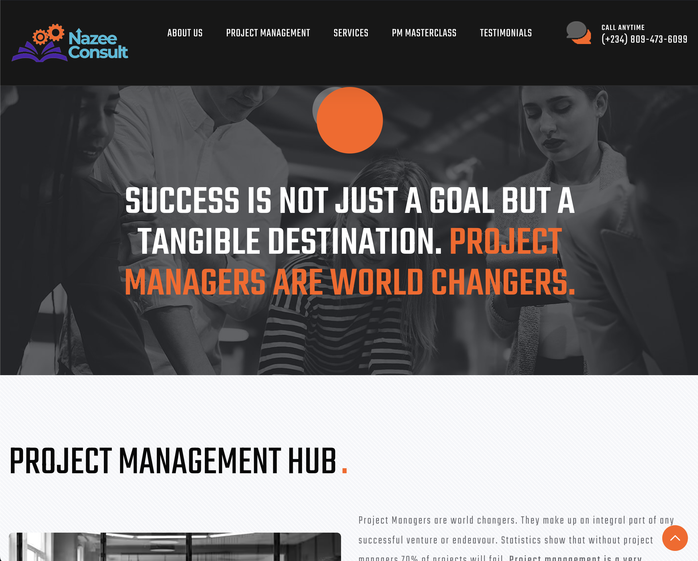

# Nazee Consult Website

## Overview
Nazee Consult is a project management firm specializing in project management services, providing project management trainings, and also offering project management professional exam guides. This repository contains the source code for the official website of Nazee Consult.

## Features
- **Project Management:** The website showcases Nazee Consult's expertise in project management, highlighting their services.
- **SvelteKit:** Built using SvelteKit, a framework for building fast web applications with Svelte, offering a highly efficient and reactive development experience.
- **Node Adapter:** The project utilizes the Node adapter for SvelteKit, enabling server-side rendering and optimized performance.
- **Responsive Design:** The website is designed to be responsive, ensuring optimal viewing and interaction across a wide range of devices and screen sizes.

## Snapshots
- 
- 
- 

## Technologies Used
- SvelteKit
- Node.js
- HTML
- CSS
- JavaScript

## Getting Started
To get started with running the project locally, follow these steps:
1. Clone this repository to your local machine.
2. Install dependencies using `npm install`  (or `pnpm install` or `yarn` or `bun`).
3. Run the development server using `npm run dev` (or start the server and open the app in a new browser tab using `npm run dev -- --open`).
4. Open your browser and navigate to `http://localhost:5173` to view the website.

## Building

To create a production version of your app:

```bash
npm run build
```
You can preview the production build with `npm run preview`.
## Contributing
Contributions are welcome! If you'd like to contribute to the project, please fork the repository, make your changes, and submit a pull request. Make sure to follow the project's coding standards and guidelines.

## License
This project is licensed under the MIT License - see the [LICENSE](LICENSE) file for details.

## Contact
For any inquiries or feedback, feel free to contact us at [hello@mindsandmachinesng.com](mailto:hello@mindsandmachinesng.com) or [+234 803 441 1661](tel:+2348034411661).
